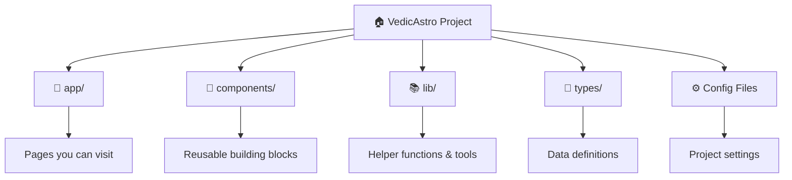
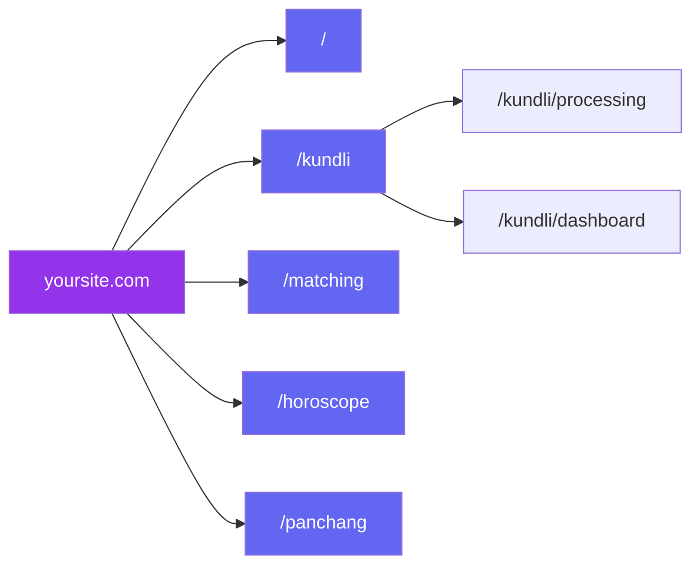
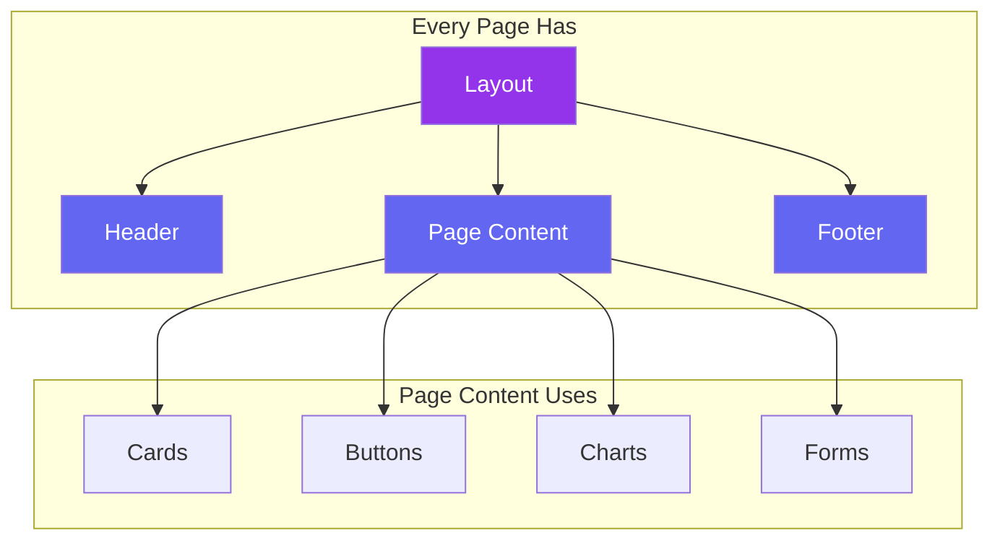
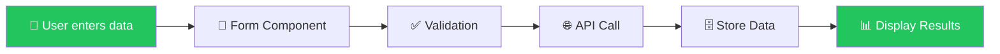
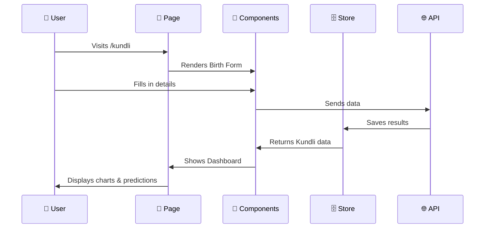
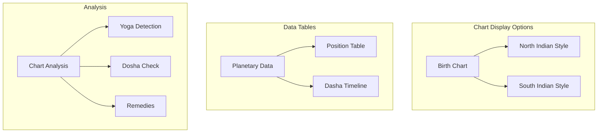

# 🌟 VedicAstro - Project Structure Guide

Welcome! This guide explains how our Vedic Astrology website is organized. Think of it like a tour of a building - we'll explore each room and explain what happens there.

---

## 📁 What is a Project Structure?

A project structure is like the **blueprint of a house**. Just as a house has different rooms for different purposes (kitchen for cooking, bedroom for sleeping), our website has different folders for different types of code.

---

## 🏗️ The Big Picture

Here's how our project is organized at the highest level:



---

## 📂 Folder-by-Folder Breakdown

### 1️⃣ The `app/` Folder - **Your Website's Pages**

Think of this as the **rooms of your house** that visitors can enter. Each folder here becomes a page on your website!

```
app/
├── page.tsx          → 🏠 Homepage (yoursite.com/)
├── layout.tsx        → 🖼️ The frame around every page
├── globals.css       → 🎨 Colors and styles for everything
│
├── kundli/           → ⭐ Kundli Section
│   ├── page.tsx      → Form to enter birth details
│   ├── processing/   → Loading animation page
│   └── dashboard/    → Your complete Kundli results
│
├── matching/         → 💑 Kundli Matching (Gun Milan)
├── horoscope/        → 🔮 Daily Horoscope
├── panchang/         → 📅 Hindu Calendar
├── numerology/       → 🔢 Numerology Calculator
├── dasha/            → ⏳ Dasha Calculator
├── transits/         → 🌍 Planetary Transits
│
└── api/              → 🔌 Behind-the-scenes data handlers
    └── kundli/       → Processes Kundli requests
```

#### How URLs Work:



---

### 2️⃣ The `components/` Folder - **Reusable Building Blocks**

Think of components like **LEGO blocks**. You build them once, then use them anywhere!

```
components/
│
├── ui/                    → 🧱 Basic Building Blocks
│   ├── button.tsx         → Clickable buttons
│   ├── card.tsx           → Content containers
│   ├── input.tsx          → Text input fields
│   └── tabs.tsx           → Tab navigation
│
├── layout/                → 🏛️ Page Structure
│   ├── header.tsx         → Top navigation bar
│   └── footer.tsx         → Bottom of every page
│
├── home/                  → 🏠 Homepage Sections
│   ├── hero.tsx           → Big welcome banner
│   ├── features.tsx       → Feature highlights
│   ├── how-it-works.tsx   → Step-by-step guide
│   └── testimonials.tsx   → User reviews
│
├── kundli/                → ⭐ Kundli Visualizations
│   ├── north-indian-chart.tsx   → Diamond-shaped chart
│   ├── south-indian-chart.tsx   → Square grid chart
│   ├── planetary-table.tsx      → Planet positions table
│   ├── dasha-timeline.tsx       → Life period timeline
│   ├── yoga-analysis.tsx        → Special combinations
│   ├── dosha-analysis.tsx       → Problem detection
│   ├── remedies.tsx             → Solutions & recommendations
│   └── birth-details-form.tsx   → Input form
│
└── providers/             → ⚡ Special Wrappers
    └── theme-provider.tsx → Dark/Light mode handler
```

#### Component Hierarchy:



---

### 3️⃣ The `lib/` Folder - **Helper Tools**

This is like your **toolbox** - functions and utilities that help other code do their job.

```
lib/
├── utils.ts              → 🔧 Small helper functions
├── store.ts              → 🗄️ Data storage (Zustand)
│
├── api/
│   └── astrology.ts      → 🌐 Talks to astrology APIs
│
└── validations/
    └── birth-details.ts  → ✅ Checks if form data is correct
```

#### How Data Flows:



---

### 4️⃣ The `types/` Folder - **Data Definitions**

This defines the **shape of our data** - like a template or form that says "a person's birth details must include name, date, time, and place."

```
types/
└── kundli.ts    → Defines what Kundli data looks like
```

**Example**: A Planet Position must have:
- Planet name (Sun, Moon, etc.)
- Sign (Aries, Taurus, etc.)
- Degree (0-30)
- House number (1-12)
- Is it retrograde? (yes/no)

---

### 5️⃣ Configuration Files - **Project Settings**

These are like the **settings menu** of your project. They tell the computer how to build and run everything.

```
Root Folder
├── package.json         → 📦 List of all tools we use
├── tsconfig.json        → ⚙️ TypeScript settings
├── tailwind.config.ts   → 🎨 Design system settings
├── next.config.ts       → 🚀 Next.js settings
├── postcss.config.mjs   → 🖌️ CSS processing
├── .eslintrc.json       → 📏 Code quality rules
├── .gitignore           → 🙈 Files to ignore in Git
├── .env.example         → 🔐 Example secret keys
└── components.json      → 🧩 shadcn/ui settings
```

---

## 🔄 How Everything Connects

Here's the complete flow when someone uses our website:



---

## 🎯 Quick Reference Table

| Folder | Purpose | Analogy |
|--------|---------|---------|
| `app/` | Website pages | Rooms in a house |
| `components/` | Reusable UI pieces | LEGO blocks |
| `lib/` | Helper functions | Toolbox |
| `types/` | Data shapes | Form templates |
| Config files | Settings | Control panel |

---

## 📱 Pages Overview

| Page | URL | What It Does |
|------|-----|--------------|
| Home | `/` | Welcome page with features |
| Kundli Form | `/kundli` | Enter birth details |
| Processing | `/kundli/processing` | Loading animation |
| Dashboard | `/kundli/dashboard` | Full Kundli results |
| Matching | `/matching` | Compare two charts |
| Horoscope | `/horoscope` | Daily predictions |
| Panchang | `/panchang` | Hindu calendar |
| Numerology | `/numerology` | Number analysis |
| Dasha | `/dasha` | Life period calculator |
| Transits | `/transits` | Current planet positions |

---

## 🧩 Key Components Explained

### Birth Chart Components



---

## 🚀 Running the Project

1. **Install dependencies** (download all tools):
   ```
   npm install
   ```

2. **Start development** (run locally):
   ```
   npm run dev
   ```

3. **Open in browser**:
   ```
   http://localhost:3000
   ```

---

## 📝 Summary

```
VedicAstro/
│
├── 📱 app/           ← Pages (what users see)
├── 🧩 components/    ← UI building blocks
├── 📚 lib/           ← Helper code
├── 📝 types/         ← Data definitions
└── ⚙️ configs        ← Project settings
```

**Remember**: 
- **Pages** live in `app/`
- **Reusable parts** live in `components/`
- **Logic & utilities** live in `lib/`
- **Data shapes** live in `types/`

---

*This project uses Next.js 15, React 19, TypeScript, and Tailwind CSS. Don't worry if you don't know these - they're just tools that help build modern websites!*
