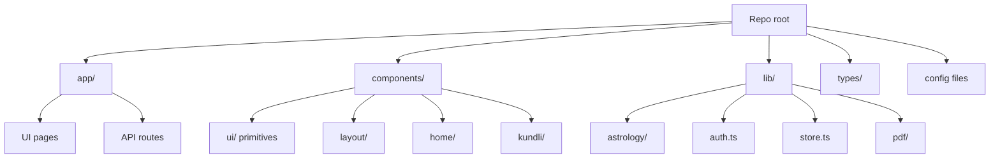
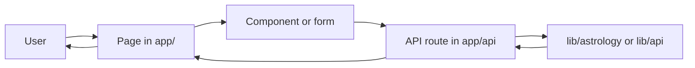
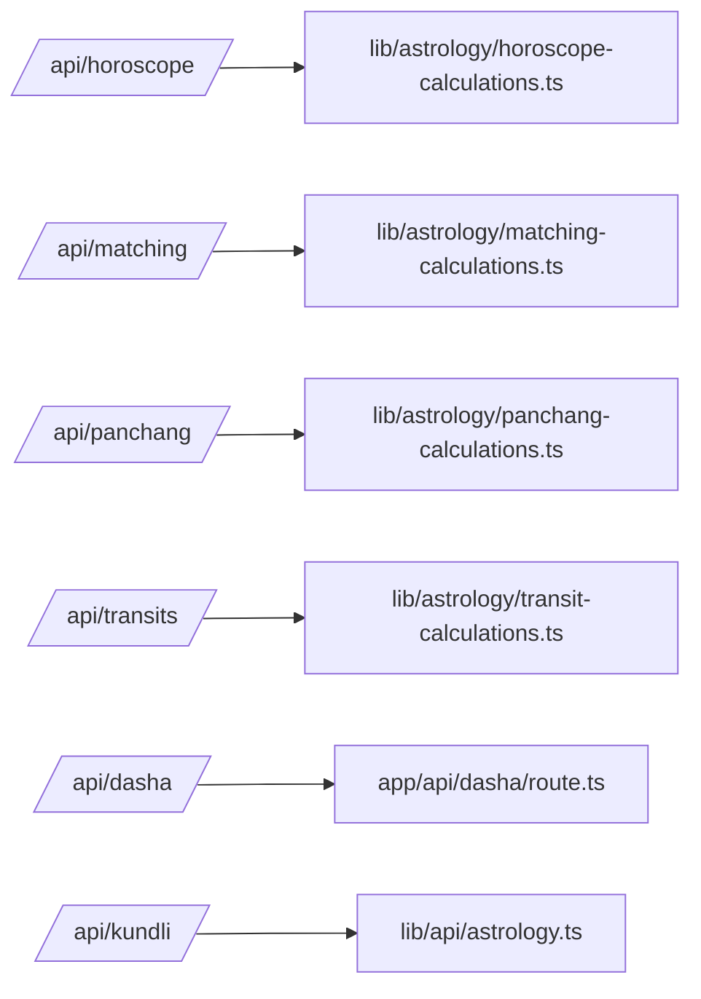
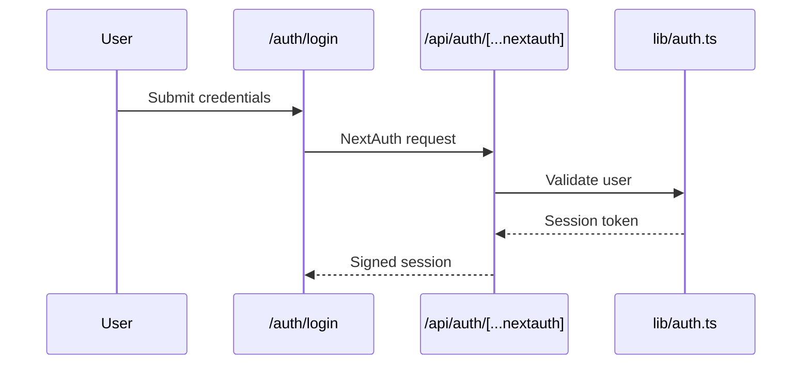

# Zodii Repo Guide

This README is a guided map of the repository. It is written for a non-technical reader and for LLMs that need to parse the project quickly.

## How to read this repo
Think of the repo like a building:
- app/ = rooms people can visit (pages) plus a back office (API routes)
- components/ = reusable building blocks used by pages
- lib/ = engines and helpers (astrology math, auth, state, PDF)
- types/ = data blueprints

## Entry points (start here)
- app/layout.tsx is the global shell (fonts, providers, header/footer).
- app/page.tsx is the home page.
- app/globals.css holds global styles and Tailwind base layers.

## Pages (routes users visit)
| Route | File | Purpose |
| --- | --- | --- |
| / | app/page.tsx | Home page sections |
| /about | app/about/page.tsx | About the company and team |
| /auth/login | app/auth/login/page.tsx | Sign in UI |
| /auth/signup | app/auth/signup/page.tsx | Sign up UI |
| /blog | app/blog/page.tsx | Blog landing and search UI |
| /contact | app/contact/page.tsx | Contact form and FAQ preview |
| /dasha | app/dasha/page.tsx | Dasha calculator UI |
| /faq | app/faq/page.tsx | FAQ search and categories |
| /horoscope | app/horoscope/page.tsx | Daily horoscope UI |
| /kundli | app/kundli/page.tsx | Birth details form |
| /kundli/processing | app/kundli/processing/page.tsx | Loading and redirect screen |
| /kundli/dashboard | app/kundli/dashboard/page.tsx | Kundli results dashboard |
| /matching | app/matching/page.tsx | Kundli matching UI |
| /numerology | app/numerology/page.tsx | Numerology calculator |
| /panchang | app/panchang/page.tsx | Panchang UI |
| /premium | app/premium/page.tsx | Pricing and plans |
| /privacy | app/privacy/page.tsx | Privacy policy |
| /rashifal | app/rashifal/page.tsx | Monthly or yearly horoscope |
| /terms | app/terms/page.tsx | Terms of service |
| /transits | app/transits/page.tsx | Planetary transits UI |

## API routes (server endpoints)
| Route | Method | File | Purpose |
| --- | --- | --- | --- |
| /api/kundli | POST | app/api/kundli/route.ts | Kundli generation (currently uses mock client) |
| /api/horoscope | GET | app/api/horoscope/route.ts | Daily or monthly horoscope calculations |
| /api/matching | POST | app/api/matching/route.ts | Gun Milan matching calculations |
| /api/panchang | GET | app/api/panchang/route.ts | Panchang calculations by date/location |
| /api/transits | GET | app/api/transits/route.ts | Current and upcoming transits |
| /api/dasha | POST | app/api/dasha/route.ts | Vimshottari dasha timeline |
| /api/auth/register | POST | app/api/auth/register/route.ts | Simple register endpoint |
| /api/auth/[...nextauth] | GET, POST | app/api/auth/[...nextauth]/route.ts | NextAuth handler |

## Astrology engine (domain logic)
Key modules live in lib/astrology:

- lib/astrology/calculations.ts - base math, signs, planets, dashas, and simple kundli generation.
- lib/astrology/precise-calculations.ts - higher precision calculations (Meeus/VSOP style).
- lib/astrology/advanced-calculations.ts - deeper analysis (Shadbala, Ashtakavarga, Yogas, Bhava analysis).
- lib/astrology/horoscope-calculations.ts - daily and monthly horoscope generation.
- lib/astrology/matching-calculations.ts - Gun Milan matching logic.
- lib/astrology/panchang-calculations.ts - tithi, nakshatra, yoga, karana, muhurta logic.
- lib/astrology/transit-calculations.ts - current and upcoming transits.

External API wrapper:
- lib/api/astrology.ts - a client placeholder for external astrology providers (currently mock responses).

## UI components
- components/ui - shadcn-style primitives (button, card, tabs, input, etc).
- components/layout - header and footer used by app/layout.tsx.
- components/home - home page sections (hero, features, how it works, testimonials).
- components/kundli - kundli-specific UI (charts, tables, analysis).
- components/providers - theme provider and auth provider.
- components/ui/places-autocomplete.tsx - location search with Google Maps or OpenStreetMap fallback.

## State, forms, and types
- lib/store.ts - Zustand state (kundli data, preferences, matching).
- lib/validations/birth-details.ts - Zod schema for birth details.
- types/kundli.ts - shared TypeScript interfaces.

## Auth flow
- lib/auth.ts - NextAuth configuration plus an in-memory user store.
- app/api/auth/register/route.ts - registration endpoint.
- app/api/auth/[...nextauth]/route.ts - NextAuth handler.

## PDF generation
- lib/pdf/generate-kundli-pdf.ts - builds a kundli report using jsPDF.

## Styling and theming
- Tailwind CSS is configured in tailwind.config.ts and used across components.
- app/globals.css defines global styles.
- next-themes provides light/dark theme switching.

## Configuration and environment
Key configs:
- package.json - scripts and dependencies
- next.config.ts - Next.js config
- tsconfig.json - TypeScript config
- tailwind.config.ts and postcss.config.mjs - styling pipeline
- components.json - shadcn config

Environment variables (see .env.example):
- API keys for astrology providers and Google Maps
- NextAuth secrets and provider keys
- Optional database and cache variables

## Running the project
- npm install
- npm run dev
- open http://localhost:3000

## Current implementation notes
- Most calculation endpoints are local math engines (lib/astrology/*).
- The external astrology API client (lib/api/astrology.ts) returns mock data and should be replaced with real API calls when integrating providers.
